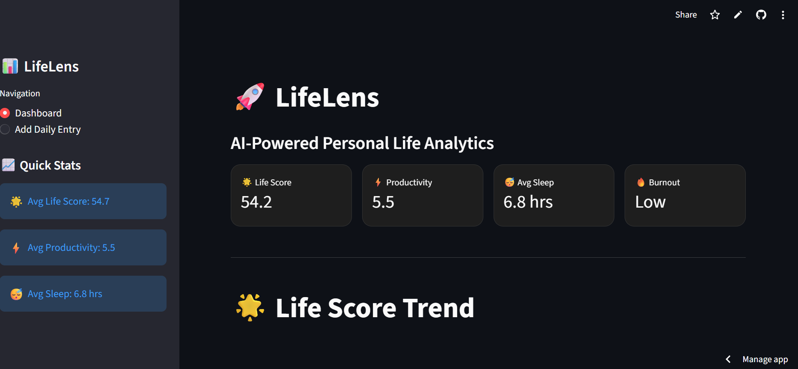
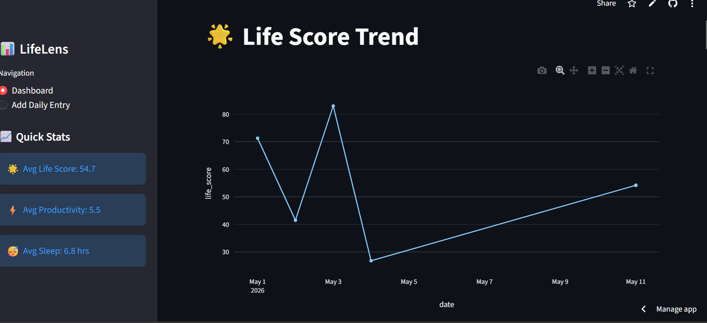
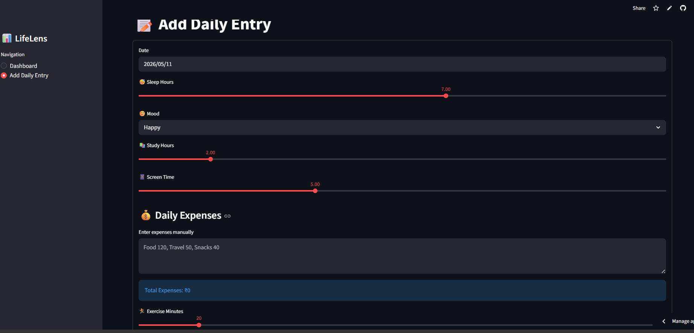

# 🚀 LifeLens — AI-Powered Personal Life Analytics System

LifeLens is an AI-powered personal analytics dashboard that tracks daily habits, productivity, mood, screen time, sleep, stress, expenses, and lifestyle patterns to generate intelligent insights and burnout predictions.

It works like:

> “Google Analytics for Human Life.”

---

# 📌 Features

## ✅ Personal Life Analytics
Track and analyze:

- Sleep hours
- Productivity
- Mood
- Study habits
- Screen time
- Exercise
- Water intake
- Daily expenses
- Stress levels

---

## ✅ AI Life Score System

LifeLens calculates a smart **Life Score** using:

- Sleep quality
- Productivity
- Exercise
- Hydration
- Stress management

---

## ✅ Burnout Risk Detection

Predicts burnout risk levels:

- Low
- Medium
- High

Based on behavioral patterns and daily activities.

---

## ✅ Machine Learning Integration

Uses **Linear Regression** from Scikit-Learn to predict:

- Productivity trends
- Behavioral impact
- Performance patterns

---

## ✅ Interactive Dashboard

Built with Streamlit + Plotly:

- KPI cards
- Trend charts
- Correlation heatmaps
- Mood analysis
- Burnout analysis
- Productivity forecasting

---

## ✅ AI Recommendations

Generates intelligent suggestions like:

- Improve sleep quality
- Reduce screen time
- Increase hydration
- Manage stress better

---

## ✅ Downloadable Reports

Users can export life analytics reports as CSV files.

---

# 🛠️ Technologies Used

| Technology | Purpose |
|---|---|
| Python | Core programming |
| Streamlit | Web application |
| Pandas | Data processing |
| Plotly | Interactive visualization |
| Scikit-Learn | Machine learning |
| NumPy | Numerical operations |

---

# 📂 Project Structure

```bash
LifeLens/
│
├── app.py
├── requirements.txt
├── README.md
│
├── data/
│   └── life_data.csv
│
├── screenshots/
├── assets/
```

---

# ▶️ Installation

## 1️⃣ Clone Repository

```bash
git clone https://github.com/Shaheen-Banu/LifeLens
```

---

## 2️⃣ Open Project Folder

```bash
cd LifeLens
```

---

## 3️⃣ Install Requirements

```bash
pip install -r requirements.txt
```

---

## 4️⃣ Run Application

```bash
streamlit run app.py
```

---

# 📊 Example Analytics

The dashboard provides:

- Life Score tracking
- Productivity forecasting
- Burnout prediction
- Mood analysis
- Correlation heatmaps
- Screen time impact analysis

---

# 🧠 Machine Learning Model

The project uses:

## Linear Regression

Input features:

- Sleep hours
- Study hours
- Screen time
- Exercise
- Water intake
- Stress level

Target:

- Productivity score

---

# 🎯 Project Objectives

- Understand personal behavioral patterns
- Improve productivity
- Detect burnout risk
- Build AI-powered self-analysis tools
- Create data-driven lifestyle insights

---

# 🌟 Future Improvements

Planned upgrades:

- AI Life Coach
- PDF report export
- Login system
- Real-time notifications
- Mobile responsiveness
- Advanced forecasting
- Cloud database
- Multi-user support

---

# 📸 Screenshots

Add screenshots here:

## Dashboard


## Analytics


## Add Entry Page


---

# 🚀 Deployment

This project can be deployed using:

- Streamlit Community Cloud
- Render
- Railway
- Hugging Face Spaces

---

# 👨‍💻 Author
Shaheen Banu

Developed as a Final Year Data Analytics Project.

---

# ⭐ If you like this project

Give this repository a star ⭐
